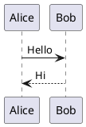

Reference for DoIt features intentionally **not** imported as full demo posts. Syntax below
is shown literally (fenced) — copy it into a real post to use. Each notes what it needs.
Full live examples live in the DoIt repo under `exampleSite/content/posts/tests/`.

<!--more-->

## Music player (APlayer)

Audio player. No extra config needed (loads its JS on demand).

```



```

Fixture: `exampleSite/content/posts/tests/music-tests`.

## Bilibili video

Embeds a Bilibili video by `BV`/`av` id.

```


```

Fixture: `exampleSite/content/posts/tests/bilibili-tests`.

## Mapbox map

Interactive map. **Requires** a Mapbox access token in config:
`[params.page.mapbox] accessToken = "..."`. Without it, the map renders empty.

```


```

Fixture: `exampleSite/content/posts/tests/mapbox-tests`.

## ECharts charts

Charts from inline JSON option objects. Loads ECharts JS on demand.

```

{ "xAxis": { "type": "category", "data": ["A","B","C"] },
  "yAxis": { "type": "value" },
  "series": [ { "data": [120, 200, 150], "type": "bar" } ] }

```

Fixture: `exampleSite/content/posts/tests/echarts-tests`.

## WaveDrom timing diagrams

Digital timing diagrams. Uses a **fenced code block** (render hook), not a shortcode:

````
```wavedrom
{ signal: [
  { name: 'clk',   wave: 'p......' },
  { name: 'data',  wave: 'x.34.5x', data: 'a b c' }
] }
```
````

Fixture: `exampleSite/content/posts/tests/wavedrom-tests`.

## PlantUML diagrams

UML diagrams. Uses a **fenced code block** (render hook). Rendering calls an external
PlantUML server, so it needs network access at view time.

````

````

Fixture: `exampleSite/content/posts/tests/plantuml-tests`.

## Bluesky post embed

Embeds a Bluesky post by URL.

```

```

Fixture: `exampleSite/content/posts/tests/bluesky-tests.md`.

> **Author note:** the `` and nested ```` ``` ```` fences above are Hugo's
> way of showing shortcode/code-fence syntax *literally* without executing it. Copy the
> inner form (e.g. ``) into a real post to actually use the feature.
