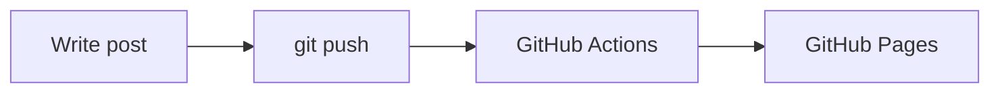

Welcome to the new blog, built with [Hugo](https://gohugo.io/) and the
[DoIt](https://github.com/HEIGE-PCloud/DoIt) theme.

<!--more-->

## Code blocks

Code blocks get syntax highlighting and a copy button:

```go
package main

import "fmt"

func main() {
    fmt.Println("Hello, world!")
}
```

## Math

Inline math like $E = mc^2$ and block math both render with KaTeX:

$$
\int_{-\infty}^{\infty} e^{-x^2}\,dx = \sqrt{\pi}
$$

## Diagrams



That's it — more soon.
