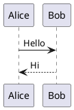

# DoIt Demo Content Reference Implementation Plan

> **For agentic workers:** REQUIRED SUB-SKILL: Use superpowers:subagent-driven-development (recommended) or superpowers:executing-plans to implement this plan task-by-task. Steps use checkbox (`- [ ]`) syntax for tracking.

**Goal:** Pull the 8 "real" DoIt demo posts into `content/posts/doit-demo/` as English-only, draft-only page bundles for local reference, plus a niche-features reference doc and a provenance README — without changing anything on the live site.

**Architecture:** Download authentic source markdown + bundle images from the DoIt theme repo (`raw.githubusercontent.com/HEIGE-PCloud/DoIt/main/exampleSite/content/...`). For each post, save `index.en.md` → `index.md`, copy its non-`zh-cn` images alongside, and transform ONLY the front-matter block to force `draft: true` + `hiddenFromHomePage: true` + `hiddenFromSearch: true`. Author one reference doc and one README. Everything is a draft, so CI (`hugo` without `--buildDrafts`) excludes it from production.

**Tech Stack:** Hugo (extended) 0.163.3, DoIt theme, `curl` for downloads, `awk` for front-matter transforms, git.

## Global Constraints

- **Source:** DoIt repo `github.com/HEIGE-PCloud/DoIt`, branch `main`, path `exampleSite/content/posts/`. Raw base URL: `https://raw.githubusercontent.com/HEIGE-PCloud/DoIt/main/exampleSite/content/posts/`.
- **Destination:** `content/posts/doit-demo/` (a sub-section under `posts/`).
- **English only:** save `index.en.md` as `index.md`; never copy any `*.zh-cn.*` file (markdown or `*.zh-cn.webp` image).
- **Forced front matter on every copied post** (in the front-matter block only): `draft: true`, `hiddenFromHomePage: true`, `hiddenFromSearch: true`. All 8 source posts contain `draft: false`; two (`create-diagrams`, `theme-documentation-content`) also contain `hiddenFromHomePage: false` which must be REPLACED (not duplicated).
- **Front-matter-only transforms:** the `theme-documentation-*` posts document front-matter keys inside their body/code blocks — the transform must touch ONLY the first `---`…`---` block, never the body.
- **Bundle-relative images:** source `featuredImage` values are bundle-relative filenames (e.g. `"featured-image.webp"`); copying the image into the same folder keeps them working. Do not rewrite them.
- **No changes to** the live site, site config, theme, or existing content. The production build must stay **26 pages**.
- **Provenance:** DoIt is MIT licensed; record the folder as third-party reference.
- **Commit identity:** name `Lucasbemo`, email `olucaszamboni@gmail.com`. Use `git -c user.name=... -c user.email=... commit`. Stage only the paths each task names — never `git add .`/`-A` (there are untracked scratch dirs).

> **"Tests" note:** No unit-test framework. Each task's verification is a build/inspection check with an expected result. The two decisive gates are: (1) `hugo --gc -D` (drafts ON) builds with **no fatal errors**; (2) `hugo --gc --minify` (drafts OFF) still emits **exactly 26 pages** (the pre-change production count).

---

## File Structure

```
content/posts/doit-demo/
├── README.md                                   # provenance (Task 5)
├── basic-markdown-syntax/
│   ├── index.md                                # Task 2
│   └── featured-image.webp
├── emoji-support/
│   ├── index.md                                # Task 2
│   └── featured-image.webp
├── pwa-support/
│   ├── index.md                                # Task 2
│   ├── featured-image.webp
│   ├── Install-PWA.webp
│   └── Installed-PWA.webp
├── create-diagrams/
│   └── index.md                                # Task 3 (no images in source)
├── theme-documentation-basics/
│   ├── index.md                                # Task 3
│   ├── featured-image.webp
│   ├── basic-configuration-preview.webp
│   ├── complete-configuration-preview.webp
│   └── language-switch.gif
├── theme-documentation-content/
│   ├── index.md                                # Task 3
│   ├── featured-image.webp
│   └── summary.webp
├── theme-documentation-built-in-shortcodes/
│   ├── index.md                                # Task 4
│   └── featured-image.webp
├── theme-documentation-extended-shortcodes/
│   ├── index.md                                # Task 4
│   ├── featured-image.webp
│   └── featured-image-preview.webp
└── niche-features-reference/
    └── index.md                                # Task 6 (authored)
```

Tasks 2–4 split the 8 posts into batches so a reviewer can gate each batch and any
build-breaking post is isolated. Each uses the identical download+transform recipe below.

### The shared per-post recipe (used verbatim in Tasks 2–4)

For a post with source folder `SRC` (under the raw base URL), destination slug `DST`, and
image list `IMGS`:

```bash
RAW="https://raw.githubusercontent.com/HEIGE-PCloud/DoIt/main/exampleSite/content/posts"
mkdir -p "content/posts/doit-demo/DST"
# 1. markdown: index.en.md -> index.md, transform ONLY the front-matter block
curl -fsSL "$RAW/SRC/index.en.md" | awk '
  /^---[ \t]*$/ { fm++; print; next }
  fm==1 {
    if ($0 ~ /^draft:[ \t]/)              { print "draft: true"; print "hiddenFromHomePage: true"; print "hiddenFromSearch: true"; next }
    if ($0 ~ /^hiddenFromHomePage:[ \t]/) { next }
    if ($0 ~ /^hiddenFromSearch:[ \t]/)   { next }
    print; next
  }
  { print }
' > "content/posts/doit-demo/DST/index.md"
# 2. images (skip if none)
for img in IMGS; do
  curl -fsSL -o "content/posts/doit-demo/DST/$img" "$RAW/SRC/$img"
done
```

The awk block: inside the first `---`…`---` block only, at the `draft:` line it emits the
three forced keys and drops any pre-existing `hiddenFromHomePage:`/`hiddenFromSearch:`
lines; the body (`fm>=2`) is passed through untouched. `curl -f` fails on HTTP errors so a
missing file is caught, not silently written as an error page.

---

## Task 1: Baseline the production page count

**Files:** none (measurement only).

**Interfaces:**
- Produces: the pre-change production page count (must be **26**), used as the regression gate in Tasks 2–6.

- [ ] **Step 1: Confirm a clean working tree and record the production build count**

Run:

```bash
cd /Users/lucas/workspace/blog-generator
git status --porcelain
hugo --gc --minify 2>&1 | grep -iE 'error|warn' || echo "clean"
hugo --gc --minify 2>&1 | awk '/Pages/{print}'
```

Expected: working tree clean (only untracked scratch like `.claude/` / `.superpowers/`);
build reports **`Pages │ 26`** and no warnings. Record `26` as the baseline.

- [ ] **Step 2: Commit nothing**

No changes yet. Proceed to Task 2.

---

## Task 2: Import batch A — simple posts (basic-markdown, emoji, pwa)

**Files:**
- Create: `content/posts/doit-demo/basic-markdown-syntax/index.md` (+ `featured-image.webp`)
- Create: `content/posts/doit-demo/emoji-support/index.md` (+ `featured-image.webp`)
- Create: `content/posts/doit-demo/pwa-support/index.md` (+ `featured-image.webp`, `Install-PWA.webp`, `Installed-PWA.webp`)

**Interfaces:**
- Consumes: the shared per-post recipe and the baseline count (26) from Task 1.
- Produces: 3 draft posts. Establishes that the recipe yields build-clean drafts.

- [ ] **Step 1: Download + transform the three posts**

Run the shared recipe for each:

```bash
cd /Users/lucas/workspace/blog-generator
RAW="https://raw.githubusercontent.com/HEIGE-PCloud/DoIt/main/exampleSite/content/posts"
import_post() {  # $1=SRC  $2=DST ; images passed as remaining args
  local SRC="$1" DST="$2"; shift 2
  mkdir -p "content/posts/doit-demo/$DST"
  curl -fsSL "$RAW/$SRC/index.en.md" | awk '
    /^---[ \t]*$/ { fm++; print; next }
    fm==1 {
      if ($0 ~ /^draft:[ \t]/)              { print "draft: true"; print "hiddenFromHomePage: true"; print "hiddenFromSearch: true"; next }
      if ($0 ~ /^hiddenFromHomePage:[ \t]/) { next }
      if ($0 ~ /^hiddenFromSearch:[ \t]/)   { next }
      print; next
    }
    { print }
  ' > "content/posts/doit-demo/$DST/index.md"
  for img in "$@"; do curl -fsSL -o "content/posts/doit-demo/$DST/$img" "$RAW/$SRC/$img"; done
}
import_post "basic-markdown-syntax" "basic-markdown-syntax" "featured-image.webp"
import_post "emoji-support" "emoji-support" "featured-image.webp"
import_post "pwa-support" "pwa-support" "featured-image.webp" "Install-PWA.webp" "Installed-PWA.webp"
```

- [ ] **Step 2: Verify the forced front matter on each**

Run:

```bash
for p in basic-markdown-syntax emoji-support pwa-support; do
  echo "== $p =="
  awk '/^---[ \t]*$/{fm++} fm==1{print} fm==2{exit}' "content/posts/doit-demo/$p/index.md" \
    | grep -iE '^draft:|^hiddenFrom'
done
```

Expected, for each post: `draft: true`, `hiddenFromHomePage: true`, `hiddenFromSearch: true`
— and **no** `hiddenFromHomePage: false` remaining.

- [ ] **Step 3: Verify images landed and are real images (not error pages)**

Run:

```bash
file content/posts/doit-demo/basic-markdown-syntax/featured-image.webp \
     content/posts/doit-demo/pwa-support/Install-PWA.webp \
     content/posts/doit-demo/pwa-support/Installed-PWA.webp \
     content/posts/doit-demo/pwa-support/featured-image.webp \
     content/posts/doit-demo/emoji-support/featured-image.webp
```

Expected: every line reports `Web/P image` (or `RIFF ... WEBP`), not `HTML`/`ASCII text`.

- [ ] **Step 4: Draft build is clean AND production count unchanged**

Run:

```bash
echo "--- drafts ON (must be no fatal error) ---"
hugo --gc -D 2>&1 | grep -iE 'error' || echo "no errors"
echo "--- drafts OFF (must still be 26) ---"
hugo --gc --minify 2>&1 | awk '/Pages/{print}'
```

Expected: drafts-ON build prints `no errors` (WARNs are acceptable — see Task 4);
drafts-OFF build still prints `Pages │ 26`. If the production count changed, a copied post
is not actually a draft — inspect its front matter before continuing.

- [ ] **Step 5: Commit**

```bash
git add content/posts/doit-demo/basic-markdown-syntax content/posts/doit-demo/emoji-support content/posts/doit-demo/pwa-support
git -c user.name="Lucasbemo" -c user.email="olucaszamboni@gmail.com" commit -m "docs(reference): import DoIt demo posts batch A (markdown, emoji, pwa)"
```

---

## Task 3: Import batch B — diagrams + theme-doc basics/content

**Files:**
- Create: `content/posts/doit-demo/create-diagrams/index.md` (no images)
- Create: `content/posts/doit-demo/theme-documentation-basics/index.md` (+ `featured-image.webp`, `basic-configuration-preview.webp`, `complete-configuration-preview.webp`, `language-switch.gif`)
- Create: `content/posts/doit-demo/theme-documentation-content/index.md` (+ `featured-image.webp`, `summary.webp`)

**Interfaces:**
- Consumes: the `import_post` function pattern from Task 2.
- Produces: 3 more draft posts, including the two that carry a pre-existing
  `hiddenFromHomePage: false` (must become `true`, not duplicated).

- [ ] **Step 1: Download + transform (note the flattened `create-diagrams` source path)**

Run (re-defining `import_post` — it is not persisted between shell sessions):

```bash
cd /Users/lucas/workspace/blog-generator
RAW="https://raw.githubusercontent.com/HEIGE-PCloud/DoIt/main/exampleSite/content/posts"
import_post() {
  local SRC="$1" DST="$2"; shift 2
  mkdir -p "content/posts/doit-demo/$DST"
  curl -fsSL "$RAW/$SRC/index.en.md" | awk '
    /^---[ \t]*$/ { fm++; print; next }
    fm==1 {
      if ($0 ~ /^draft:[ \t]/)              { print "draft: true"; print "hiddenFromHomePage: true"; print "hiddenFromSearch: true"; next }
      if ($0 ~ /^hiddenFromHomePage:[ \t]/) { next }
      if ($0 ~ /^hiddenFromSearch:[ \t]/)   { next }
      print; next
    }
    { print }
  ' > "content/posts/doit-demo/$DST/index.md"
  for img in "$@"; do curl -fsSL -o "content/posts/doit-demo/$DST/$img" "$RAW/$SRC/$img"; done
}
import_post "how-to-DoIt/create-diagrams" "create-diagrams"
import_post "theme-documentation-basics" "theme-documentation-basics" "featured-image.webp" "basic-configuration-preview.webp" "complete-configuration-preview.webp" "language-switch.gif"
import_post "theme-documentation-content" "theme-documentation-content" "featured-image.webp" "summary.webp"
```

- [ ] **Step 2: Verify the two pre-`hiddenFromHomePage:false` posts were corrected**

Run:

```bash
for p in create-diagrams theme-documentation-content theme-documentation-basics; do
  echo "== $p =="
  awk '/^---[ \t]*$/{fm++} fm==1{print} fm==2{exit}' "content/posts/doit-demo/$p/index.md" \
    | grep -iE '^draft:|^hiddenFrom'
done
```

Expected, each post: exactly one `hiddenFromHomePage: true` (no `: false`), one
`hiddenFromSearch: true`, and `draft: true`. Critically, `create-diagrams` and
`theme-documentation-content` must NOT show any `hiddenFromHomePage: false` line.

- [ ] **Step 3: Verify images are real**

Run:

```bash
file content/posts/doit-demo/theme-documentation-basics/*.webp \
     content/posts/doit-demo/theme-documentation-basics/language-switch.gif \
     content/posts/doit-demo/theme-documentation-content/*.webp
```

Expected: `.webp` → `Web/P image`; `.gif` → `GIF image data`. None should be `HTML`/text.

- [ ] **Step 4: Draft build clean + production still 26**

Run:

```bash
hugo --gc -D 2>&1 | grep -iE 'error' || echo "no errors"
hugo --gc --minify 2>&1 | awk '/Pages/{print}'
```

Expected: `no errors`; `Pages │ 26`.

- [ ] **Step 5: Commit**

```bash
git add content/posts/doit-demo/create-diagrams content/posts/doit-demo/theme-documentation-basics content/posts/doit-demo/theme-documentation-content
git -c user.name="Lucasbemo" -c user.email="olucaszamboni@gmail.com" commit -m "docs(reference): import DoIt demo posts batch B (diagrams, theme-doc basics/content)"
```

---

## Task 4: Import batch C — the shortcode-documentation posts (highest build risk)

**Files:**
- Create: `content/posts/doit-demo/theme-documentation-built-in-shortcodes/index.md` (+ `featured-image.webp`)
- Create: `content/posts/doit-demo/theme-documentation-extended-shortcodes/index.md` (+ `featured-image.webp`, `featured-image-preview.webp`)

**Interfaces:**
- Consumes: the `import_post` function pattern.
- Produces: the final 2 draft posts. These contain LIVE shortcode examples (admonitions,
  mermaid, and possibly mapbox/echarts) — the batch most likely to emit WARNs or, if any
  shortcode hard-errors, to fail the draft build.

- [ ] **Step 1: Download + transform**

Run:

```bash
cd /Users/lucas/workspace/blog-generator
RAW="https://raw.githubusercontent.com/HEIGE-PCloud/DoIt/main/exampleSite/content/posts"
import_post() {
  local SRC="$1" DST="$2"; shift 2
  mkdir -p "content/posts/doit-demo/$DST"
  curl -fsSL "$RAW/$SRC/index.en.md" | awk '
    /^---[ \t]*$/ { fm++; print; next }
    fm==1 {
      if ($0 ~ /^draft:[ \t]/)              { print "draft: true"; print "hiddenFromHomePage: true"; print "hiddenFromSearch: true"; next }
      if ($0 ~ /^hiddenFromHomePage:[ \t]/) { next }
      if ($0 ~ /^hiddenFromSearch:[ \t]/)   { next }
      print; next
    }
    { print }
  ' > "content/posts/doit-demo/$DST/index.md"
  for img in "$@"; do curl -fsSL -o "content/posts/doit-demo/$DST/$img" "$RAW/$SRC/$img"; done
}
import_post "theme-documentation-built-in-shortcodes" "theme-documentation-built-in-shortcodes" "featured-image.webp"
import_post "theme-documentation-extended-shortcodes" "theme-documentation-extended-shortcodes" "featured-image.webp" "featured-image-preview.webp"
```

- [ ] **Step 2: Verify front matter + images**

Run:

```bash
for p in theme-documentation-built-in-shortcodes theme-documentation-extended-shortcodes; do
  echo "== $p =="
  awk '/^---[ \t]*$/{fm++} fm==1{print} fm==2{exit}' "content/posts/doit-demo/$p/index.md" | grep -iE '^draft:|^hiddenFrom'
done
file content/posts/doit-demo/theme-documentation-built-in-shortcodes/*.webp \
     content/posts/doit-demo/theme-documentation-extended-shortcodes/*.webp
```

Expected: each post shows `draft: true` + both hidden keys `true`; images are `Web/P image`.

- [ ] **Step 3: Draft build — capture the FULL output (errors AND warnings)**

Run:

```bash
hugo --gc -D 2>&1 | tee /tmp/doit-draftbuild.txt | grep -iE 'error' || echo "no errors"
echo "--- warnings (expected, non-fatal; document them) ---"
grep -iE 'warn' /tmp/doit-draftbuild.txt || echo "no warnings"
```

Expected: **no `error` lines** (the build must succeed). WARNs are acceptable and expected
here (e.g. a mapbox example with no `params.page.mapbox.accessToken`, or an
external-service shortcode). **Record any WARNs** in the commit body / report.

Decision rule: if a copied post causes a FATAL error (build fails), remove that one post
(`rm -rf content/posts/doit-demo/<slug>`), note it as culled in the report, and re-run —
do not disable the shortcode or edit the demo body.

- [ ] **Step 4: Production still 26**

Run:

```bash
hugo --gc --minify 2>&1 | awk '/Pages/{print}'
```

Expected: `Pages │ 26`.

- [ ] **Step 5: Commit (note any WARNs/culls in the body)**

```bash
git add content/posts/doit-demo/theme-documentation-built-in-shortcodes content/posts/doit-demo/theme-documentation-extended-shortcodes
git -c user.name="Lucasbemo" -c user.email="olucaszamboni@gmail.com" commit -m "docs(reference): import DoIt demo posts batch C (shortcode docs)

Draft build clean (no fatal errors). Non-fatal WARNs observed: <list, or 'none'>."
```

---

## Task 5: Provenance README

**Files:**
- Create: `content/posts/doit-demo/README.md`

**Interfaces:**
- Consumes: nothing.
- Produces: provenance/marker file. **Correction (discovered during execution):** Hugo does
  NOT ignore `README.md` — as a plain content file it renders and publishes at
  `/posts/doit-demo/readme/`, pushing production to 27. The README therefore carries
  `_build: {render: never, list: never}` + `draft: true` front matter so Hugo never renders
  it in any build (no site-config change). Production stays 26.

- [ ] **Step 1: Write the README**

Create `content/posts/doit-demo/README.md`:

```markdown
# DoIt demo content — local reference (do not publish)

These posts are **third-party content** copied from the DoIt theme's example site,
kept locally as inspiration/reference for how DoIt posts and features are written.

- **Source:** https://github.com/HEIGE-PCloud/DoIt — `exampleSite/content/posts/`
  (branch `main`), English (`index.en.md`) versions only.
- **License:** DoIt is MIT licensed. This content belongs to the DoIt authors.
- **Status:** every post here is `draft: true` and `hiddenFromHomePage` /
  `hiddenFromSearch: true`. The production deploy runs `hugo` **without** `--buildDrafts`,
  so nothing in this folder ever publishes to https://lucasbemo.github.io/.
- **Refresh:** re-run the import from the same source paths to update.

Not written by Lucasbemo. See `niche-features-reference/` for shortcodes intentionally
not imported as full posts (mapbox, echarts, plantuml, wavedrom, aplayer/music, bilibili,
bluesky).
```

- [ ] **Step 2: Confirm it changes neither build**

Run:

```bash
hugo --gc --minify 2>&1 | awk '/Pages/{print}'   # expect 26
hugo --gc -D 2>&1 | grep -iE 'error' || echo "no errors"
```

Expected: `Pages │ 26`; `no errors`.

- [ ] **Step 3: Commit**

```bash
git add content/posts/doit-demo/README.md
git -c user.name="Lucasbemo" -c user.email="olucaszamboni@gmail.com" commit -m "docs(reference): add provenance README for DoIt demo content"
```

---

## Task 6: Niche-features reference doc

**Files:**
- Create: `content/posts/doit-demo/niche-features-reference/index.md`

**Interfaces:**
- Consumes: nothing (authored content).
- Produces: a single draft reference post documenting the 7 features not imported as full
  posts. All shortcode syntax is shown in fenced code blocks (literal — not executed), so
  it cannot error the build or render empty widgets.

- [ ] **Step 1: Write the reference doc**

Create `content/posts/doit-demo/niche-features-reference/index.md` with EXACTLY this content
(the shortcode/code-fence syntax is copied verbatim from the DoIt test fixtures):

````markdown
---
title: "Niche Features Reference (DoIt)"
date: 2019-12-01T00:00:00+00:00
draft: true
hiddenFromHomePage: true
hiddenFromSearch: true
description: "Syntax reference for DoIt shortcodes not imported as full demo posts."
tags: ["reference"]
categories: ["documentation"]
---

Reference for DoIt features intentionally **not** imported as full demo posts. Syntax below
is shown literally (fenced) — copy it into a real post to use. Each notes what it needs.
Full live examples live in the DoIt repo under `exampleSite/content/posts/tests/`.

<!--more-->

## Music player (APlayer)

Audio player. No extra config needed (loads its JS on demand).

```



```

Fixture: `exampleSite/content/posts/tests/music-tests`.

## Bilibili video

Embeds a Bilibili video by `BV`/`av` id.

```


```

Fixture: `exampleSite/content/posts/tests/bilibili-tests`.

## Mapbox map

Interactive map. **Requires** a Mapbox access token in config:
`[params.page.mapbox] accessToken = "..."`. Without it, the map renders empty.

```


```

Fixture: `exampleSite/content/posts/tests/mapbox-tests`.

## ECharts charts

Charts from inline JSON option objects. Loads ECharts JS on demand.

```

{ "xAxis": { "type": "category", "data": ["A","B","C"] },
  "yAxis": { "type": "value" },
  "series": [ { "data": [120, 200, 150], "type": "bar" } ] }

```

Fixture: `exampleSite/content/posts/tests/echarts-tests`.

## WaveDrom timing diagrams

Digital timing diagrams. Uses a **fenced code block** (render hook), not a shortcode:

````
```wavedrom
{ signal: [
  { name: 'clk',   wave: 'p......' },
  { name: 'data',  wave: 'x.34.5x', data: 'a b c' }
] }
```
````

Fixture: `exampleSite/content/posts/tests/wavedrom-tests`.

## PlantUML diagrams

UML diagrams. Uses a **fenced code block** (render hook). Rendering calls an external
PlantUML server, so it needs network access at view time.

````

````

Fixture: `exampleSite/content/posts/tests/plantuml-tests`.

## Bluesky post embed

Embeds a Bluesky post by URL.

```

```

Fixture: `exampleSite/content/posts/tests/bluesky-tests.md`.
````

> **Author note:** the `` and nested ```` ``` ```` fences above are Hugo's
> way of showing shortcode/code-fence syntax *literally* without executing it. Copy the
> inner form (e.g. ``) into a real post to actually use the feature.

- [ ] **Step 2: Verify it is a draft and does not execute any shortcode**

Run:

```bash
awk '/^---[ \t]*$/{fm++} fm==1{print} fm==2{exit}' content/posts/doit-demo/niche-features-reference/index.md | grep -iE '^draft:|^hiddenFrom'
hugo --gc -D 2>&1 | grep -iE 'error' || echo "no errors"
```

Expected: `draft: true`, `hiddenFromHomePage: true`, `hiddenFromSearch: true`; and the
drafts-ON build prints `no errors` (the fenced examples are literal, so no shortcode runs).

- [ ] **Step 3: Production still 26**

Run:

```bash
hugo --gc --minify 2>&1 | awk '/Pages/{print}'
```

Expected: `Pages │ 26`.

- [ ] **Step 4: Commit**

```bash
git add content/posts/doit-demo/niche-features-reference
git -c user.name="Lucasbemo" -c user.email="olucaszamboni@gmail.com" commit -m "docs(reference): add niche-features shortcode reference (mapbox, echarts, plantuml, wavedrom, music, bilibili, bluesky)"
```

---

## Task 7: Final verification — drafts render locally, production is untouched

**Files:** none (verification only).

**Interfaces:**
- Consumes: everything from Tasks 2–6.
- Produces: end-to-end confirmation that the reference content renders as drafts and the
  live-bound production build is byte-for-byte unaffected in page count.

- [ ] **Step 1: All 9 demo entries are drafts, hidden, English-only**

Run:

```bash
cd /Users/lucas/workspace/blog-generator
echo "=== count index.md under doit-demo (expect 9) ===" && find content/posts/doit-demo -name index.md | wc -l
echo "=== every one is draft+hidden (expect 9 lines each) ===" 
for f in content/posts/doit-demo/*/index.md; do awk '/^---[ \t]*$/{fm++} fm==1{print} fm==2{exit}' "$f"; done | grep -c '^draft: true'
for f in content/posts/doit-demo/*/index.md; do awk '/^---[ \t]*$/{fm++} fm==1{print} fm==2{exit}' "$f"; done | grep -c '^hiddenFromHomePage: true'
for f in content/posts/doit-demo/*/index.md; do awk '/^---[ \t]*$/{fm++} fm==1{print} fm==2{exit}' "$f"; done | grep -c '^hiddenFromSearch: true'
echo "=== no zh-cn files leaked (expect 0) ===" && find content/posts/doit-demo -name '*zh-cn*' | wc -l
```

Expected: 9 `index.md` files; `draft: true` count = 9; each hidden key count = 9; zero
`zh-cn` files.

- [ ] **Step 2: Production build — count unchanged and demo absent**

Run:

```bash
rm -rf public
hugo --gc --minify 2>&1 | awk '/Pages/{print}'
echo "=== demo must NOT be in production output (expect 0) ===" && find public -path '*doit-demo*' | wc -l
echo "=== demo not in production search index (expect 0) ===" && grep -c -i 'doit-demo\|Basic Markdown Syntax' public/index.json
```

Expected: `Pages │ 26`; zero `doit-demo` paths in `public/`; `0` matches in the production
search index. This proves the live site is unaffected.

- [ ] **Step 3: Draft server renders the demo but hides it from home/search**

Run (start the server in the background, probe, then stop it):

```bash
hugo server -D -p 1314 >/tmp/doit-serve.log 2>&1 &
SERVER_PID=$!
sleep 4
echo -n "demo post reachable (expect 200): " && curl -s -o /dev/null -w '%{http_code}\n' "http://localhost:1314/posts/doit-demo/basic-markdown-syntax/"
echo -n "hidden from home stream (expect 0): " && curl -s "http://localhost:1314/" | grep -c -i 'Basic Markdown Syntax'
echo -n "hidden from local search index (expect 0): " && curl -s "http://localhost:1314/index.json" | grep -c -i 'Basic Markdown Syntax'
kill $SERVER_PID 2>/dev/null
```

Expected: demo post → `200`; home stream count → `0`; local search count → `0`. (This
confirms drafts render for you locally yet stay out of your home page and search.)

- [ ] **Step 4: No commit needed**

Verification only. If every check passed, the feature is complete.

---

## Self-Review (completed by plan author)

**Spec coverage:**
- 8 real posts imported as `content/posts/doit-demo/<slug>/index.md` → Tasks 2–4 (with exact source-path mapping incl. flattened `create-diagrams`). ✅
- en-only (`index.en.md`→`index.md`, no zh-cn) → recipe + Task 7 Step 1 zero-`zh-cn` check. ✅
- Bundle images copied, verified real → Tasks 2–4 Step 3 (`file`). ✅
- Force `draft/hiddenFromHomePage/hiddenFromSearch: true`, front-matter-only, replacing pre-existing `hiddenFromHomePage:false` → awk recipe + Task 3 Step 2 explicit check. ✅
- Niche-features reference doc (7 features, verified syntax, fenced/literal, needs-noted, fixture pointers) → Task 6. ✅
- Provenance README (MIT, drafts never publish) → Task 5. ✅
- Clean draft build, cull fatal-erroring posts, document WARNs → Task 4 Step 3 decision rule. ✅
- Production stays 26 pages / demo invisible to live site → Task 1 baseline + every task's production check + Task 7 Step 2. ✅

**Placeholder scan:** No TBD/TODO. The one `<list, or 'none'>` in Task 4's commit message is an intentional fill-in-the-observed-value, not an unresolved plan gap. The niche-doc body is fully specified verbatim.

**Type/name consistency:** Raw base URL, destination `content/posts/doit-demo/`, the awk transform, and the three forced keys are identical across Tasks 2–6. Slug names match the File Structure map and Task 7's counts (9 = 8 posts + 1 reference doc). Baseline page count `26` is consistent across Tasks 1, 2, 3, 4, 5, 6, 7.
