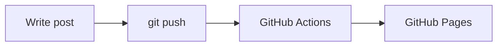

# Hugo + DoIt Blog Implementation Plan

> **For agentic workers:** REQUIRED SUB-SKILL: Use superpowers:subagent-driven-development (recommended) or superpowers:executing-plans to implement this plan task-by-task. Steps use checkbox (`- [ ]`) syntax for tracking.

**Goal:** Build a professional personal/tech blog with Hugo + the DoIt theme, deployed to GitHub Pages via GitHub Actions from a single source-only repo (`lucasbemo.github.io`).

**Architecture:** Hugo (extended) site using the DoIt theme imported as a **Hugo Module** (version-pinned in `go.mod`, no submodules). Config is split into four TOML files under `config/_default/`. A GitHub Actions workflow builds the site on an ephemeral runner and deploys the output straight to Pages — `public/` is never committed. The existing rendered site on the repo's `master` branch is replaced by this source (old build stays recoverable in git history).

**Tech Stack:** Hugo v0.163.3 extended, Go 1.26 (for Hugo Modules), DoIt theme v1.0.2 (`github.com/HEIGE-PCloud/DoIt`), TOML config, GitHub Actions, GitHub Pages.

## Global Constraints

- **Hugo:** extended edition, pinned to `0.163.3` locally and in CI. Copy this exact version string into the workflow's `HUGO_VERSION`.
- **Go:** `1.26` — required by Hugo Modules to fetch the theme. Workflow uses `go-version: '1.26'`.
- **DoIt theme:** module path `github.com/HEIGE-PCloud/DoIt`, pinned to `v1.0.2`. Never edit theme files directly — override via `assets/`, `layouts/`, and config only.
- **baseURL:** `https://lucasbemo.github.io/` (domain root — this is a GitHub User Pages site; the repo MUST be named `lucasbemo.github.io`).
- **Language:** single language, `en`.
- **Repo model:** source only. `public/`, `resources/`, `.hugo_build.lock` are git-ignored and MUST NOT be committed. The site is built by CI, never checked in.
- **Deploy branch:** `master` (the repo's existing default branch). The workflow triggers on push to `master`.
- **Config location:** all site config lives in `config/_default/` split across exactly four files: `module.toml`, `hugo.toml`, `params.toml`, `menu.toml`.
- **Author identity for commits:** name `Lucasbemo`, email `olucaszamboni@gmail.com`.

> **Note on "tests":** This is an infrastructure/config project with no unit-test framework. Each task's verification is a concrete **build or serve check** — running `hugo`, `hugo server`, or inspecting generated output — with an expected result stated. Treat "run the check, see it fail, implement, see it pass, commit" as the TDD cycle throughout.

---

## File Structure

```
blog-generator/                      (local folder name; repo remote = lucasbemo.github.io)
├── config/_default/
│   ├── module.toml          # DoIt Hugo Module import
│   ├── hugo.toml            # core: baseURL, title, lang, taxonomies, pagination, outputs, markup
│   ├── params.toml          # all DoIt theme params (features, profile, search, seo, social)
│   └── menu.toml            # top navigation
├── content/
│   ├── _index.md            # homepage front matter
│   ├── posts/
│   │   └── hello-world.md   # seed post (draft: false)
│   └── about/
│       └── index.md         # about page (leaf bundle)
├── archetypes/
│   └── posts.md             # `hugo new` template for posts
├── assets/
│   └── css/
│       └── _custom.scss     # theme-safe style overrides (empty starter)
├── static/
│   ├── robots.txt           # generated by Hugo instead — see Task 5 note
│   └── images/
│       └── .gitkeep         # avatar/og images go here
├── layouts/
│   └── .gitkeep             # override slot (unused for now)
├── .github/workflows/
│   └── deploy.yml           # build + deploy to GitHub Pages
├── go.mod                   # Hugo module deps (generated)
├── go.sum                   # Hugo module checksums (generated)
├── .gitignore
├── Makefile
└── README.md
```

---

## Task 1: Initialize Hugo Module project with DoIt theme

**Files:**
- Create: `config/_default/module.toml`
- Create: `config/_default/hugo.toml` (skeleton — expanded in Task 2)
- Create: `go.mod`, `go.sum` (generated by `hugo mod` commands — do not hand-write)

**Interfaces:**
- Produces: a buildable Hugo site whose theme is DoIt resolved via Hugo Modules. Later tasks add config and content on top. The module path used everywhere is `github.com/HEIGE-PCloud/DoIt`.

- [ ] **Step 1: Write the skeleton core config**

Create `config/_default/hugo.toml` with the minimum needed to build:

```toml
baseURL = "https://lucasbemo.github.io/"
title = "Lucasbemo's Blog"
languageCode = "en"
defaultContentLanguage = "en"
```

- [ ] **Step 2: Write the module import config**

Create `config/_default/module.toml`:

```toml
# DoIt theme imported as a Hugo Module (no git submodule).
[[imports]]
  path = "github.com/HEIGE-PCloud/DoIt"
```

- [ ] **Step 3: Initialize the Hugo module**

Run from the project root:

```bash
hugo mod init github.com/lucasbemo/lucasbemo.github.io
```

Expected: creates `go.mod` containing `module github.com/lucasbemo/lucasbemo.github.io`.

- [ ] **Step 4: Fetch the DoIt theme at the pinned version**

Run:

```bash
hugo mod get github.com/HEIGE-PCloud/DoIt@v1.0.2
```

Expected: `go.mod` now lists `require github.com/HEIGE-PCloud/DoIt v1.0.2`; `go.sum` is created. If the command reports needing Go, confirm `go version` shows `go1.26.x`.

- [ ] **Step 5: Run the build check (expect it to succeed with an empty site)**

Run:

```bash
hugo --gc
```

Expected: exits 0, prints a build summary (0 or more pages), and creates `public/`. No "module not found" or "theme not found" errors. It is fine that there is no content yet.

- [ ] **Step 6: Verify the theme actually resolved**

Run:

```bash
hugo mod graph
```

Expected: output includes a line referencing `github.com/HEIGE-PCloud/DoIt@v1.0.2`.

- [ ] **Step 7: Commit**

```bash
git add config go.mod go.sum
git commit -m "feat: scaffold Hugo module project with DoIt theme v1.0.2"
```

(`public/` is not added — it will be git-ignored in Task 5. Do not commit it.)

---

## Task 2: Core site config — taxonomies, pagination, search output, markup, menu

**Files:**
- Modify: `config/_default/hugo.toml` (expand the skeleton from Task 1)
- Create: `config/_default/menu.toml`

**Interfaces:**
- Consumes: the skeleton `hugo.toml` and DoIt module from Task 1.
- Produces: `outputs.home` includes `JSON` (required for the Fuse.js search index consumed in Task 3/4); taxonomies `tags`/`categories`/`series`/`authors`; a top nav menu. Menu URLs `/posts/`, `/tags/`, `/categories/`, `/about/` are relied on by content in Task 4.

- [ ] **Step 1: Replace `hugo.toml` with the full core config**

Overwrite `config/_default/hugo.toml` with:

```toml
baseURL = "https://lucasbemo.github.io/"
title = "Lucasbemo's Blog"
languageCode = "en"
languageName = "English"
defaultContentLanguage = "en"
hasCJKLanguage = false

# Let Hugo generate robots.txt (see Task 5)
enableRobotsTXT = true
# Emoji shortcodes like :smile:
enableEmoji = true
# Use git commit info for lastmod (works in CI with fetch-depth: 0)
enableGitInfo = true

# Number of posts per pager
[pagination]
  pagerSize = 12

# Taxonomies (singular = plural)
[taxonomies]
  category = "categories"
  tag = "tags"
  series = "series"
  author = "authors"

# Output formats — JSON on home is REQUIRED for local Fuse.js search
[outputs]
  home = ["HTML", "RSS", "JSON"]
  page = ["HTML"]
  section = ["HTML", "RSS"]
  taxonomy = ["HTML", "RSS"]

# Markup: syntax highlighting, Goldmark (math passthrough), TOC
[markup]
  [markup.highlight]
    codeFences = true
    guessSyntax = true
    lineNos = false
    lineNumbersInTable = true
    # noClasses MUST be false so DoIt's theme CSS controls colors
    noClasses = false
  [markup.goldmark]
    [markup.goldmark.renderer]
      # DoIt relies on raw HTML in content
      unsafe = true
    [markup.goldmark.extensions]
      definitionList = true
      footnote = true
      linkify = true
      strikethrough = true
      table = true
      taskList = true
      typographer = true
    # Passthrough lets KaTeX delimiters survive Markdown processing
    [markup.goldmark.extensions.passthrough]
      enable = true
      [markup.goldmark.extensions.passthrough.delimiters]
        block = [['\[', '\]'], ['$$', '$$']]
        inline = [['\(', '\)']]
  [markup.tableOfContents]
    startLevel = 2
    endLevel = 6
```

- [ ] **Step 2: Create the navigation menu**

Create `config/_default/menu.toml`:

```toml
[[main]]
  identifier = "posts"
  name = "Posts"
  url = "/posts/"
  weight = 1
[[main]]
  identifier = "categories"
  name = "Categories"
  url = "/categories/"
  weight = 2
[[main]]
  identifier = "tags"
  name = "Tags"
  url = "/tags/"
  weight = 3
[[main]]
  identifier = "about"
  name = "About"
  url = "/about/"
  weight = 4
```

- [ ] **Step 3: Run the build check**

Run:

```bash
hugo --gc
```

Expected: exits 0 with no errors.

- [ ] **Step 4: Verify the search JSON output format is produced**

Run:

```bash
hugo --gc && test -f public/index.json && echo "SEARCH_INDEX_OK"
```

Expected: prints `SEARCH_INDEX_OK` (Hugo emitted `public/index.json` because `home` includes `JSON`).

- [ ] **Step 5: Commit**

```bash
git add config/_default/hugo.toml config/_default/menu.toml
git commit -m "feat: add core Hugo config, taxonomies, search output, and nav menu"
```

---

## Task 3: Theme params — enable features (search, code copy, math, mermaid, SEO)

**Files:**
- Create: `config/_default/params.toml`

**Interfaces:**
- Consumes: taxonomies and `outputs.home = JSON` from Task 2.
- Produces: `[search].type = "fuse"` (local search backed by `public/index.json`); per-page defaults for TOC/code-copy/math/mermaid consumed by content front matter in Task 4; `[home.profile]` shown on the homepage; commented analytics slot for later.

- [ ] **Step 1: Create the full theme params file**

Create `config/_default/params.toml`:

```toml
# DoIt theme version this config targets
version = "1.0.X"
# Default color scheme: "light", "dark", "black", "auto"
defaultTheme = "auto"
# Public repo URL — enables "last modified" links (enableGitInfo = true)
gitRepo = "https://github.com/lucasbemo/lucasbemo.github.io"
# Date format used across the site
dateFormat = "2006-01-02"
# Default Open Graph / Twitter image (add the file in static/images/ later)
images = ["/images/og-default.png"]

# Site author (shown in footer and article meta)
[author]
  name = "Lucasbemo"
  link = "https://github.com/lucasbemo"

# App / favicon behavior
[app]
  title = "Lucasbemo's Blog"
  noFavicon = false

# Header / nav bar
[header]
  themeChangeMode = "select"
  [header.title]
    name = "Lucasbemo's Blog"
    typeit = false

# Footer
[footer]
  enable = true
  hugo = true
  copyright = true
  author = true
  since = 2017

# Home page
[home]
  rss = 10
  [home.profile]
    enable = true
    # Add static/images/avatar.png (see README) or set gravatarEmail
    avatarURL = "/images/avatar.png"
    title = "Lucasbemo's Blog"
    subtitle = "Notes on software, systems, and things I'm learning."
    typeit = true
    social = true
  [home.posts]
    enable = true
    paginate = 7

# Local search (Fuse.js) — no external service, uses public/index.json
[search]
  enable = true
  type = "fuse"
  contentLength = 4000
  placeholder = "Search posts…"
  maxResultLength = 10
  snippetLength = 40
  highlightTag = "em"
  absoluteURL = false
  [search.fuse]
    isCaseSensitive = false
    minMatchCharLength = 2
    findAllMatches = false
    location = 0
    threshold = 0.1
    distance = 100
    ignoreLocation = true
    useExtendedSearch = false
    ignoreFieldNorm = false

# Social links shown on the home profile (add more as needed)
[social]
  GitHub = "lucasbemo"

# Per-page feature defaults (front matter can override per post)
[page]
  # whether to show a link to the raw Markdown source
  linkToMarkdown = true
  enableLastMod = true
  enableWordCount = true
  enableReadingTime = true
  [page.toc]
    enable = true
    keepStatic = false
    auto = true
  [page.code]
    maxShownLines = 30
    lineNos = true
    wrap = false
    header = true
    # copy-to-clipboard button is on by default in DoIt's code header
  [page.math]
    # Global default off; turn on per-post via front matter `math.enable: true`
    enable = false
    copyTex = true
    mhchem = true
  [page.mapbox]
    # unused; left at theme defaults
  [page.share]
    enable = true
    Facebook = false
    Twitter = true
    HackerNews = true
    Linkedin = true
    Telegram = false
    Line = false

# SEO
[seo]
  image = "/images/og-default.png"

# Search-engine verification tokens (fill in if/when you verify the site)
[verification]
  google = ""
  bing = ""

# Privacy-friendly analytics — DISABLED by default.
# To enable GoatCounter later: set enable = true and add a [analytics.goatcounter]
# block per DoIt docs, OR use one of the providers below.
[analytics]
  enable = false
  [analytics.google]
    id = ""
    anonymizeIP = true
  [analytics.plausible]
    data_domain = ""
    src = ""
```

- [ ] **Step 2: Run the build check**

Run:

```bash
hugo --gc
```

Expected: exits 0. A warning about a missing `avatar.png` image resource is acceptable at this stage (fixed by adding the file or ignored — the site still builds).

- [ ] **Step 3: Verify search is wired to Fuse (not Algolia)**

Run:

```bash
hugo --gc && grep -q '"' public/index.json && echo "FUSE_INDEX_OK"
```

Expected: prints `FUSE_INDEX_OK` — `public/index.json` exists and contains the search index JSON that Fuse.js will load client-side.

- [ ] **Step 4: Commit**

```bash
git add config/_default/params.toml
git commit -m "feat: configure DoIt params — local search, code copy, math, mermaid, SEO"
```

---

## Task 4: Content — homepage, seed post, about page, and post archetype

**Files:**
- Create: `archetypes/posts.md`
- Create: `content/_index.md`
- Create: `content/posts/hello-world.md`
- Create: `content/about/index.md`

**Interfaces:**
- Consumes: menu URLs `/posts/`, `/about/` (Task 2); `[home.profile]` and `[page]` feature defaults (Task 3).
- Produces: a homepage, one published post exercising code + math + mermaid, and an about page. `hugo new posts/<name>.md` uses `archetypes/posts.md` (consumed by the `make new` target in Task 5).

- [ ] **Step 1: Create the post archetype**

Create `archetypes/posts.md`:

```markdown
---
title: "{{ replace .TranslationBaseName "-" " " | title }}"
subtitle: ""
date: {{ .Date }}
lastmod: {{ .Date }}
draft: true
authors: ["Lucasbemo"]
description: ""

tags: []
categories: []
series: []

hiddenFromHomePage: false
hiddenFromSearch: false

featuredImage: ""

toc:
  enable: true
math:
  enable: false
---

<!--more-->
```

- [ ] **Step 2: Create the homepage front matter**

Create `content/_index.md`:

```markdown
---
title: "Home"
---
```

- [ ] **Step 3: Create the seed post (exercises code, math, mermaid, TOC)**

Create `content/posts/hello-world.md`:

````markdown
---
title: "Hello World"
subtitle: "The first post on the new site"
date: 2026-07-04T10:00:00-03:00
lastmod: 2026-07-04T10:00:00-03:00
draft: false
authors: ["Lucasbemo"]
description: "Kicking off the blog: a quick tour of what this site can do."

tags: ["meta", "hugo"]
categories: ["general"]

toc:
  enable: true
math:
  enable: true
---

Welcome to the new blog, built with [Hugo](https://gohugo.io/) and the
[DoIt](https://github.com/HEIGE-PCloud/DoIt) theme.

<!--more-->

## Code blocks

Code blocks get syntax highlighting and a copy button:

```go
package main

import "fmt"

func main() {
    fmt.Println("Hello, world!")
}
```

## Math

Inline math like $E = mc^2$ and block math both render with KaTeX:

$$
\int_{-\infty}^{\infty} e^{-x^2}\,dx = \sqrt{\pi}
$$

## Diagrams



That's it — more soon.
````

- [ ] **Step 4: Create the about page**

Create `content/about/index.md`:

```markdown
---
title: "About"
date: 2026-07-04T10:00:00-03:00
draft: false
description: "About Lucasbemo and this blog."

# About is a standalone page, not a post
hiddenFromHomePage: true
hiddenFromSearch: false

comment: false
---

Hi, I'm **Lucasbemo**. This is my corner of the web where I write about
software, systems, and whatever I'm currently learning.

- Find me on [GitHub](https://github.com/lucasbemo).
```

- [ ] **Step 5: Run the build check**

Run:

```bash
hugo --gc
```

Expected: exits 0. Build summary shows Pages count increased (homepage, post, about, taxonomy pages).

- [ ] **Step 6: Verify the seed post and about page rendered**

Run:

```bash
hugo --gc && test -f public/posts/hello-world/index.html && test -f public/about/index.html && echo "CONTENT_OK"
```

Expected: prints `CONTENT_OK`.

- [ ] **Step 7: Verify the post is in the search index**

Run:

```bash
grep -qi "hello world" public/index.json && echo "SEARCH_CONTENT_OK"
```

Expected: prints `SEARCH_CONTENT_OK` (the published post is indexed for Fuse search).

- [ ] **Step 8: Manual visual check (local server)**

Run:

```bash
hugo server -D
```

Then open `http://localhost:1313/` and confirm, before stopping the server with Ctrl-C:
- Homepage shows the profile (title/subtitle) and the "Hello World" post.
- The post page shows: a working TOC, a code block **with a copy button**, rendered KaTeX math, and a rendered Mermaid diagram.
- The search icon opens a search box and typing "hello" returns the post.
- The About page loads from the nav.

Expected: all of the above render correctly.

- [ ] **Step 9: Commit**

```bash
git add archetypes content
git commit -m "feat: add homepage, seed post, about page, and post archetype"
```

---

## Task 5: Project scaffolding — gitignore, Makefile, README, custom SCSS, static assets

**Files:**
- Create: `.gitignore`
- Create: `Makefile`
- Create: `README.md`
- Create: `assets/css/_custom.scss`
- Create: `static/images/.gitkeep`
- Create: `layouts/.gitkeep`

**Interfaces:**
- Consumes: the `hugo new posts/...` archetype (Task 4) via the `make new` target; the module setup (Task 1) via `make update`.
- Produces: developer workflow commands and repo hygiene. `_custom.scss` is auto-loaded by DoIt (theme-safe styling override slot).

- [ ] **Step 1: Create `.gitignore`**

Create `.gitignore`:

```gitignore
# Hugo build output — NEVER committed (built by CI, served by Pages)
/public/
/resources/
.hugo_build.lock

# Hugo modules cache (if ever vendored locally)
/_vendor/

# OS / editor cruft
.DS_Store
Thumbs.db
*.swp

# Local-only Claude settings
.claude/settings.local.json
```

- [ ] **Step 2: Verify `public/` is now ignored**

Run:

```bash
hugo --gc >/dev/null && git status --porcelain | grep -q '^?? public/' && echo "NOT_IGNORED" || echo "IGNORED_OK"
```

Expected: prints `IGNORED_OK` (git does not see `public/` as an untracked path).

- [ ] **Step 3: Create the `Makefile`**

Create `Makefile` (use real TAB indentation for recipe lines, not spaces):

```makefile
.PHONY: serve new build update clean

# Live preview including drafts at http://localhost:1313
serve:
	hugo server -D

# Create a new draft post: make new title="my-post-slug"
new:
	hugo new posts/$(title).md

# Production build into ./public
build:
	hugo --gc --minify

# Update the DoIt theme to the latest release
update:
	hugo mod get -u github.com/HEIGE-PCloud/DoIt
	hugo mod tidy

# Remove build artifacts
clean:
	rm -rf public resources .hugo_build.lock
```

- [ ] **Step 4: Verify the Makefile targets parse and build works**

Run:

```bash
make build
```

Expected: runs `hugo --gc --minify`, exits 0, regenerates `public/`.

- [ ] **Step 5: Create the custom style override slot**

Create `assets/css/_custom.scss`:

```scss
// Theme-safe custom styles. DoIt auto-loads this file.
// Add overrides here instead of editing theme files.
// Example:
// .home-profile { text-align: center; }
```

- [ ] **Step 6: Create placeholder directories**

Create `static/images/.gitkeep` (empty file) and `layouts/.gitkeep` (empty file) so the directories are tracked.

- [ ] **Step 7: Create the `README.md`**

Create `README.md`:

````markdown
# lucasbemo.github.io

Personal blog built with [Hugo](https://gohugo.io/) (extended) and the
[DoIt](https://github.com/HEIGE-PCloud/DoIt) theme, deployed to GitHub Pages.

**Live site:** https://lucasbemo.github.io/

## Requirements

- Hugo **extended** `0.163.3`
- Go `1.26+` (Hugo Modules fetch the theme)

## Local development

```bash
make serve      # live preview with drafts at http://localhost:1313
make new title="my-post"   # create content/posts/my-post.md from the archetype
make build      # production build into ./public
make update     # update the DoIt theme to its latest release
make clean      # remove build artifacts
```

The theme is a **Hugo Module** pinned in `go.mod` — there are no git submodules.
`public/` is generated and **git-ignored**; it is built by CI, never committed.

## Config

All config lives in `config/_default/`:

| File | Responsibility |
|------|----------------|
| `module.toml` | DoIt theme module import |
| `hugo.toml` | core: baseURL, taxonomies, pagination, outputs, markup |
| `params.toml` | theme params: search, profile, code/math/mermaid, SEO |
| `menu.toml` | top navigation |

## Deployment

Push to `master` → GitHub Actions builds with Hugo and deploys to Pages.
No manual build or upload. One-time setup: **Settings → Pages → Source = "GitHub Actions"**.

## Enabling optional features later

- **Avatar / OG image:** add `static/images/avatar.png` and `static/images/og-default.png`.
- **Comments (Giscus):** enable GitHub Discussions on the repo, then add a
  `[comment.giscus]` block in `params.toml` per the DoIt docs.
- **Analytics (GoatCounter/Plausible):** set `[analytics].enable = true` in
  `params.toml` and fill in the provider block.

## Alternative hosting (future option)

This source is host-agnostic. To get **per-PR preview deploys**, connect the repo to
**Cloudflare Pages** or **Netlify** (build command `hugo --minify`, output `public`,
env `HUGO_VERSION=0.163.3`) and delete `.github/workflows/deploy.yml`. Note: the
`lucasbemo.github.io` domain only works with GitHub Pages — Cloudflare/Netlify would
serve from a `*.pages.dev` / `*.netlify.app` URL or a custom domain you own.
````

- [ ] **Step 8: Commit**

```bash
git add .gitignore Makefile README.md assets static layouts
git commit -m "chore: add gitignore, Makefile, README, custom SCSS slot, and static dirs"
```

---

## Task 6: GitHub Actions deploy workflow

**Files:**
- Create: `.github/workflows/deploy.yml`

**Interfaces:**
- Consumes: the module setup (`hugo mod get`) and `config/` from Tasks 1–3.
- Produces: an automated Pages deployment on push to `master`. Requires the one-time repo setting (Task 7) `Settings → Pages → Source = GitHub Actions`.

- [ ] **Step 1: Create the workflow**

Create `.github/workflows/deploy.yml`:

```yaml
name: Deploy Hugo site to Pages

on:
  push:
    branches: [master]
  workflow_dispatch:

# Least-privilege permissions needed for Pages deployment
permissions:
  contents: read
  pages: write
  id-token: write

# Allow one concurrent deployment; don't cancel an in-progress prod deploy
concurrency:
  group: pages
  cancel-in-progress: false

defaults:
  run:
    shell: bash

jobs:
  build:
    runs-on: ubuntu-latest
    env:
      HUGO_VERSION: 0.163.3
    steps:
      - name: Install Hugo CLI (extended)
        run: |
          wget -O "${{ runner.temp }}/hugo.deb" \
            "https://github.com/gohugoio/hugo/releases/download/v${HUGO_VERSION}/hugo_extended_${HUGO_VERSION}_linux-amd64.deb"
          sudo dpkg -i "${{ runner.temp }}/hugo.deb"
      - name: Checkout
        uses: actions/checkout@v4
        with:
          fetch-depth: 0        # full history so enableGitInfo lastmod works
      - name: Setup Go
        uses: actions/setup-go@v5
        with:
          go-version: '1.26'
      - name: Setup Pages
        id: pages
        uses: actions/configure-pages@v5
      - name: Install Hugo modules
        run: hugo mod get
      - name: Build with Hugo
        env:
          HUGO_ENVIRONMENT: production
          TZ: America/Sao_Paulo
        run: hugo --gc --minify --baseURL "${{ steps.pages.outputs.base_url }}/"
      - name: Upload artifact
        uses: actions/upload-pages-artifact@v3
        with:
          path: ./public

  deploy:
    environment:
      name: github-pages
      url: ${{ steps.deployment.outputs.page_url }}
    runs-on: ubuntu-latest
    needs: build
    steps:
      - name: Deploy to GitHub Pages
        id: deployment
        uses: actions/deploy-pages@v4
```

- [ ] **Step 2: Validate the workflow YAML locally**

Run:

```bash
python3 -c "import yaml,sys; yaml.safe_load(open('.github/workflows/deploy.yml')); print('YAML_OK')"
```

Expected: prints `YAML_OK` (the file is syntactically valid YAML). If `python3` lacks PyYAML, alternatively confirm the file structure by eye — every `uses:` pins a major version and the two jobs are `build` then `deploy`.

- [ ] **Step 3: Commit**

```bash
git add .github/workflows/deploy.yml
git commit -m "ci: add GitHub Actions workflow to build and deploy to GitHub Pages"
```

---

## Task 7: Wire remote, replace `master`, and go live

> **DESTRUCTIVE STEP — read first.** This replaces the old rendered CleanWhite site on
> `master` with the new source. The old site remains recoverable via git reflog/history
> on GitHub, but the visible branch content is overwritten. Get explicit user
> confirmation before Step 4 (the force push).

**Files:** none created — this task operates on git remotes and GitHub settings.

**Interfaces:**
- Consumes: the complete committed source from Tasks 1–6.
- Produces: the live site at `https://lucasbemo.github.io/`.

- [ ] **Step 1: Confirm the local branch name and that everything is committed**

Run:

```bash
git branch --show-current && git status --porcelain
```

Expected: `git status --porcelain` prints nothing (clean tree). Note the current branch name (likely `master`). If it is not `master`, rename it:

```bash
git branch -M master
```

- [ ] **Step 2: Add the GitHub remote**

Run (SSH; use the HTTPS URL instead if the user prefers):

```bash
git remote add origin git@github.com:lucasbemo/lucasbemo.github.io.git
git remote -v
```

Expected: `origin` points at `lucasbemo/lucasbemo.github.io`.

- [ ] **Step 3: Fetch and inspect the existing remote history (safety check)**

Run:

```bash
git fetch origin
git log --oneline origin/master | head -5
```

Expected: shows the old rendered-site commits. Confirm with the user that this old build is expendable (it stays in history / reflog after the push). **Do not proceed to Step 4 without confirmation.**

- [ ] **Step 4: Push the new source, replacing `master`**

Because local history and remote history are unrelated, this is a force push. Use
`--force-with-lease` so it aborts if the remote changed unexpectedly:

```bash
git push --force-with-lease origin master
```

Expected: push succeeds; `origin/master` now contains the Hugo source.

- [ ] **Step 5: Switch GitHub Pages to the Actions source (manual, one-time)**

In the browser: **repo → Settings → Pages → Build and deployment → Source → select "GitHub Actions"**. (Confirm with the user, or run the API equivalent below.)

Optional CLI equivalent:

```bash
gh api -X POST repos/lucasbemo/lucasbemo.github.io/pages -f build_type=workflow 2>/dev/null \
  || gh api -X PUT repos/lucasbemo/lucasbemo.github.io/pages -f build_type=workflow
```

Expected: Pages build type is `workflow`.

- [ ] **Step 6: Confirm the deploy workflow ran**

Run:

```bash
gh run list --repo lucasbemo/lucasbemo.github.io --workflow "Deploy Hugo site to Pages" --limit 1
```

Expected: a run appears (triggered by the Step 4 push). Wait for it to complete:

```bash
gh run watch --repo lucasbemo/lucasbemo.github.io $(gh run list --repo lucasbemo/lucasbemo.github.io --limit 1 --json databaseId --jq '.[0].databaseId')
```

Expected: run concludes with `success`.

- [ ] **Step 7: Verify the live site**

Run:

```bash
curl -sI https://lucasbemo.github.io/ | head -1
```

Expected: `HTTP/2 200`. Then open `https://lucasbemo.github.io/` in a browser and confirm the DoIt homepage, the Hello World post (code/math/mermaid), search, and the About page all work — matching the local check from Task 4 Step 8.

- [ ] **Step 8: Final commit (if any tracked changes remain)**

Nothing new should need committing here. If Steps changed tracked files, commit them; otherwise this task ends with the site live.

---

## Self-Review (completed by plan author)

**Spec coverage:**
- Hugo Modules + DoIt v1.0.2 → Task 1. ✅
- Split config (4 files) → Tasks 1–3. ✅
- Directory structure → Tasks 1–6. ✅
- Local search (Fuse) → Task 3 (`[search].type="fuse"`) + Task 2 (`outputs.home` JSON). ✅
- Code copy / KaTeX math / Mermaid / TOC → Task 3 config + Task 4 seed post exercises all. ✅
- SEO (OG/Twitter, sitemap, RSS, robots) → `hugo.toml` outputs + `enableRobotsTXT` (Task 2), `[seo]`/`images` (Task 3); sitemap & RSS are Hugo built-ins. ✅
- Analytics slot commented/off → Task 3 `[analytics].enable=false`. ✅
- Comments deferred → documented in README (Task 5). ✅
- CI/CD to Pages (single repo, `public/` never committed) → Task 6 workflow + Task 5 `.gitignore`. ✅
- Content workflow (make serve/new/build/update, archetype) → Task 4 archetype + Task 5 Makefile. ✅
- Start fresh (no migration) → Task 4 seeds new content only. ✅
- Replace `master` with source, force-with-lease, confirm first → Task 7. ✅
- Pages Source = GitHub Actions one-time setting → Task 7 Step 5. ✅
- Cloudflare/custom-domain future note → README (Task 5). ✅
- Local folder stays `blog-generator` → no rename task; noted in file structure. ✅

**Placeholder scan:** No TBD/TODO left in the plan's instructions. (The archetype template intentionally contains an empty body after `<!--more-->`, which is correct Hugo scaffolding, not a plan placeholder.)

**Type/name consistency:** Module path `github.com/HEIGE-PCloud/DoIt` and version `v1.0.2` used identically across Tasks 1, 5, 6. Branch `master`, baseURL `https://lucasbemo.github.io/`, and `HUGO_VERSION=0.163.3` consistent across Tasks 2, 6, 7. Menu URLs (`/posts/`, `/about/`) match content paths in Task 4.
